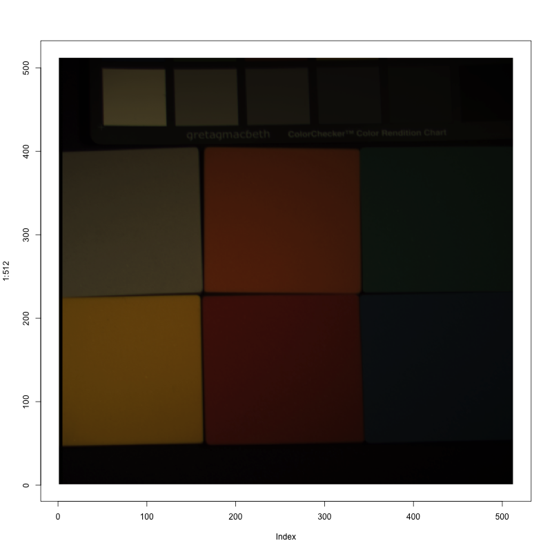

### Purpose

Combine Multispectral images into a regular colored image.

For more information about the multispectral images: [Multispectral images](http://www1.cs.columbia.edu/CAVE/databases/multispectral/)

``` r
# Check for missing packages and install them.

list.pkg<- c("png", "abind")

req_pkg<-function(packages){
  new.pkg <- list.pkg[!(list.pkg %in% installed.packages()[,"Package"])]
  if(length(new.pkg)) 
    install.packages(new.pkg)
  sapply(list.pkg, require, character.only = TRUE)
}

req_pkg(list.pkg)
```

    ## Loading required package: png

    ## Loading required package: abind

    ##   png abind 
    ##  TRUE  TRUE

``` r
# set directory of work to png files.
#
#current_directory<-getwd()
#setwd(current_directory)
#images_path=paste(current_directory,"/sponges_ms/",sep = "") # set images path to variable to read files 

images_path="/Users/yadi/Downloads/sponges_ms/"

# Reading all png files from directory above
files = list.files(path = images_path, pattern="*.png")
cat("Number of files: ",length(files))
```

    ## Number of files:  31

By defination in Wikipedia, The visible spectrum is the portion of the electromagnetic spectrum that is visible to the human eye.

| Color                                     | Wavelength | Frquency     | Photon energy |
|-------------------------------------------|------------|--------------|---------------|
| <span style="color:#7F00FF">violet</span> | 380-450 nm | 668- 798 THz | 2.75-3.26 eV  |
| <span style="color:#0000FF">blue</span>   | 450-495 nm | 606- 668 THz | 2.50-2.75 eV  |
| <span style="color:#00FF00">green</span>  | 495-570 nm | 526- 606 THz | 2.17-2.50 eV  |
| <span style="color:#FFFF00">yellow</span> | 570-590 nm | 508- 526 THz | 2.10-2.17 eV  |
| <span style="color:#FF8000">orange</span> | 590-620 nm | 484- 508 THz | 2.00-2.10 eV  |
| <span style="color:#FF0000">red</span>    | 620-750 nm | 400- 484 THz | 1.65-2.00 eV  |

#### A function to convert Wavelength to RGB

``` r
# The idea of function from:
# 1. http://stackoverflow.com/questions/1472514/convert-light-frequency-to-rgb
# 2. http://www.physics.sfasu.edu/astro/color/spectra.html
# 3. http://www.efg2.com/Lab/ScienceAndEngineering/Spectra.htm
# 4. http://www.noah.org/wiki/Wavelength_to_RGB_in_Python


# define function name 

spec_rgb<-function(wave){
  
    
  # ----------------------------------
  # wave: Wave length
  # R,G,B: color code after convert 
  # attenuation : factor for vision limits
  # Gamma:  Gamma correction ration 
  # ----------------------------------

  R=0.0
  G=0.0
  B=0.0
  attenuation=0
  Gamma = 0.8

  # finding best fit for R,G,B
  if (wave >= 380 & wave < 440){
    R = - (wave - 440) / (440 - 380)
    G = 0.0
    B = 1.0
  }else if (wave >= 440 & wave < 490){
    R = 0.0
    G = (wave - 440) / (490 - 440)
    B = 1.0
    
  }else if(wave >= 490 & wave < 510){
    R = 0.0
    G = 1.0
    B = -(wave - 510) / (510 - 490)
    
  }else if(wave >= 510 & wave < 580){
    R = (wave - 510) / (580 - 510)
    G = 1.0
    B = 0.0
    
  }else if( wave >= 580 & wave < 645){
    R = 1.0
    G = -(wave - 645) / (645 - 580)
    B = 0.0
  }else if (wave >= 645 & wave <= 780){
    R = 1.0
    G = 0.0
    B = 0.0
  }else{
    R = 0.0
    G = 0.0
    B = 0.0
  }
  
  # ----------------
  # Let the intensity fall off near the vision limits
  # ----------------
  if((wave >= 380) & (wave<420)){
    attenuation = 0.3 + 0.7 * (wave - 380) / (420 - 380)
  }else if((wave >= 420) & (wave<701)){
    attenuation = 1.0
  }else if((wave >= 701) & (wave<781)){
    attenuation = 0.3 + 0.7 * (780 - wave) / (780 - 700)
  }else{
    attenuation = 0.0
  }
  
  # --------------
  # GAMMA ADJUST
  #---------------
  R= (R * attenuation) ** Gamma
  G= (G * attenuation) ** Gamma
  B= (B * attenuation) ** Gamma
  
  #--------------
  # Returning results as list
  result=list(R,G,B)
  return(result)
}
```

##### The idea behind the solution

The range of rgb component is between 0 to 1 (also when you are reading original images in R) so first of all, I have wavelength for each image that simply allow me to get RGB code by passing to “spec\_rgb” function.

Second step is applying this RGB code to original image, for this part basically by multiplying every element(matrix) of RGB code to the image we will get 3 separate matrix as for red, green, blue, by binding this 3 colors(as matrix) we can get color picture. But we have to read all images and apply these steps at same time because as we know that our images in different wavelength, that means we have to save result for each image in large matrix (e.g: "R\_biglist").

``` r
# create list of waveLenght for each file - start from: 400nm to 700nm 
waveLenght<-seq(400, 700, 10)
# 3 lists for vlaues of R,G,B 
R_biglist <- list()
G_biglist <- list()
B_biglist <- list()

# Main function to convert 
for(j in 1:length(files)){
  # Reading images from source 
  img <- readPNG(paste(images_path,files[j],sep = "") )
  # Get RGB code for waveLenght and save it as matrix
  s = as.matrix(spec_rgb(waveLenght[j]))
  # Multiply every the values of image to RGB code that we got in previus line 
  # creating matrix for each R  G and B (as temp)
  r <- img  * s[[1]]
  g <- img  * s[[2]]
  b <- img  * s[[3]]
  # pass temp matrix to the main matrix to use in next part 
  R_biglist[[j]] <- r
  G_biglist[[j]] <- g
  B_biglist[[j]] <- b
  
}
```

After apply wavelength and bind them to the large matrix, we need to apply “mean” function for them. Because the goal is to plot just one picture and we have 31 images as matrix, so basically by applying “mean” for each color to our large matrix finally we will got 3 RGB color to plot them.

``` r
# binding evry list in main list for each color 
Y <- do.call(cbind,R_biglist)
Y <- array(Y, dim=c(dim(R_biglist[[1]]), length(R_biglist)))
# getting "R" mean from all images   
meanR<-apply(Y, c(1, 2), mean, na.rm = TRUE)
```

``` r
# same for "G"
Y <- do.call(cbind,G_biglist)
Y <- array(Y, dim=c(dim(G_biglist[[1]]), length(G_biglist)))
# getting "G" mean from all images   
meanG<-apply(Y, c(1, 2), mean, na.rm = TRUE)
```

``` r
# For "B"
Y <- do.call(cbind,B_biglist)
Y <- array(Y, dim=c(dim(B_biglist[[1]]), length(B_biglist)))
# getting "B" mean from all images   
meanB<-apply(Y, c(1, 2), mean, na.rm = TRUE)
```

##### Result

``` r
# binding all matrix after calculate mean to create matrix to plot 
col <- abind(meanR, meanG, meanB, along=3)
png("resultImage.png", width = 800, height = 800, units ="px")
plot (1:512 , type="n" ) 
rasterImage(col, 1, 1, 512, 512)
dev.off()
```

    ## quartz_off_screen 
    ##                 2



``` r
# free memory 
R_biglist<-NULL
G_biglist<-NULL
B_biglist<-NULL
meanR<-NULL
meanG<-NULL
meanB<-NULL
```

Session information:

``` r
sessionInfo()
```

    ## R version 3.3.3 (2017-03-06)
    ## Platform: x86_64-apple-darwin13.4.0 (64-bit)
    ## Running under: macOS Sierra 10.12.3
    ## 
    ## locale:
    ## [1] en_US.UTF-8/en_US.UTF-8/en_US.UTF-8/C/en_US.UTF-8/en_US.UTF-8
    ## 
    ## attached base packages:
    ## [1] stats     graphics  grDevices utils     datasets  methods   base     
    ## 
    ## other attached packages:
    ## [1] abind_1.4-5 png_0.1-7  
    ## 
    ## loaded via a namespace (and not attached):
    ##  [1] backports_1.0.5 magrittr_1.5    rprojroot_1.2   tools_3.3.3    
    ##  [5] htmltools_0.3.5 yaml_2.1.14     Rcpp_0.12.9     stringi_1.1.2  
    ##  [9] rmarkdown_1.3   knitr_1.15.1    stringr_1.2.0   digest_0.6.12  
    ## [13] evaluate_0.10

References:

1.  <https://en.wikipedia.org/wiki/SRGB#The_sRGB_transfer_function_.28.22gamma.22.29>
2.  <http://www.noah.org/wiki/Wavelength_to_RGB_in_Python>
3.  <https://en.wikipedia.org/wiki/Visible_spectrum>
4.  <http://stackoverflow.com/questions/3407942/rgb-values-of-visible-spectrum>
5.  <http://stackoverflow.com/questions/1472514/convert-light-frequency-to-rgb>
